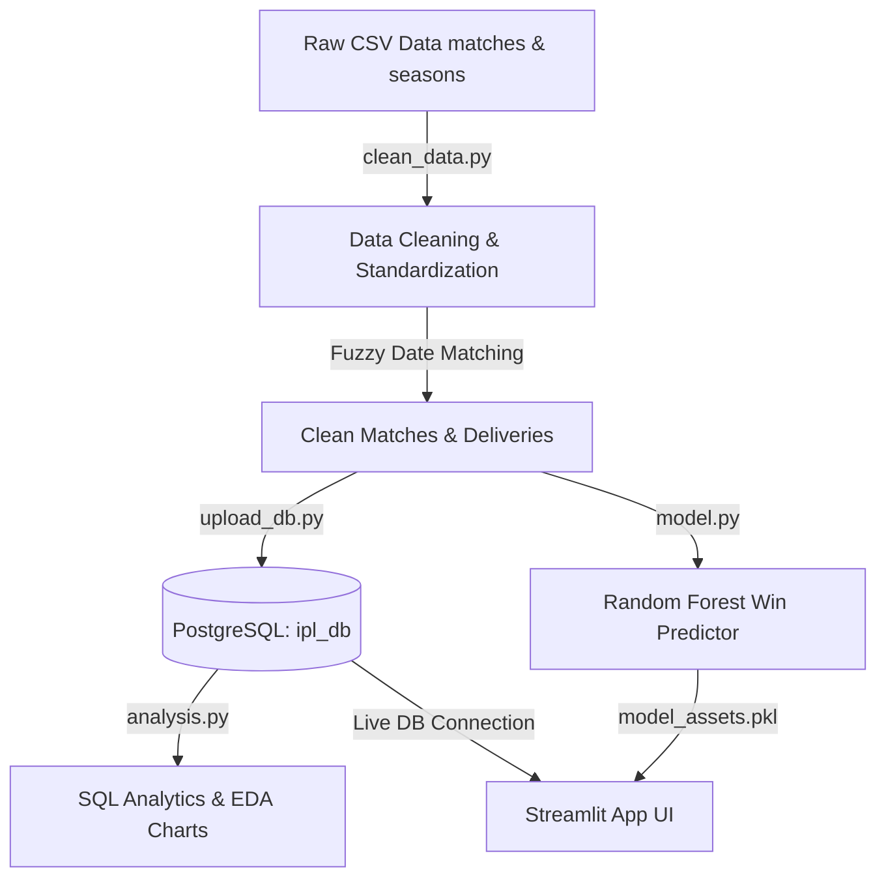

# IPL End-to-End Analytics Pipeline & Win Predictor

This repository houses an end-to-end data engineering and machine learning pipeline for the Indian Premier League (IPL) cricket matches spanning **2008 to 2026**. 

Designed as a professional portfolio asset, this project demonstrates competencies in Python ETL, PostgreSQL relational database design, SQL analytics, Machine Learning win-prediction modeling, and interactive Streamlit web applications.

---

## 🏗️ Architecture & Pipeline Flow

The project structures data flow through a multi-tiered pipeline:



---

## 📁 Project Structure

* **`data/`**: Cleaned and raw data directories.
* **`scripts/`**: Core pipeline execution files.
  * `clean_data.py`: Preprocessing, team-name standardizations, and ball-by-ball merging (295,732 rows).
  * `upload_db.py`: PostgreSQL schema builder and chunked batch uploader.
  * `analysis.py`: Executes SQL queries and saves Matplotlib EDA charts.
  * `model.py`: Encodes features, trains Random Forest Classifier, and exports model assets.
* **`sql/`**: SQL queries for database metrics.
* **`plots/`**: Generated analytical plots.
* **`dashboard/`**: Power BI design reference manuals.
* **`app/`**: Interactive Streamlit web application.

---

## 🚀 Technical Setup & Run Guide

### 1. Prerequisites
Ensure you have Python 3.9+ and PostgreSQL installed locally. Install Python dependencies:
```bash
pip install pandas numpy matplotlib seaborn scikit-learn sqlalchemy psycopg2 streamlit tabulate
```

### 2. Run the Data Pipeline
Execute the scripts sequentially to clean the data, populate the database, query statistics, and train the model:

```bash
# Step 1: Clean and combine datasets
python scripts/clean_data.py

# Step 2: Upload clean tables to local PostgreSQL (ensure postgres is running)
python scripts/upload_db.py

# Step 3: Run SQL analysis and save EDA charts
python scripts/analysis.py

# Step 4: Train Random Forest classifier
python scripts/model.py
```

### 3. Launch the Streamlit Predictor
Run the local web server to interact with the model:
```bash
streamlit run app/streamlit_app.py
```

---

## 📊 Database Schema & SQL Analytics

The database `ipl_db` consists of two tables linked by a foreign key constraint:
* **`matches`**: Primary Key `match_id` (Cricsheet ID), containing match-level metadata.
* **`deliveries`**: Foreign Key `match_id`, containing ball-by-ball records.

### Sample Insights (From SQL Queries):
* **Toss Impact:** Analysis on 1,243 matches shows that winning the toss has a **50.52%** correlation with winning the match (virtually 50/50).
* **Top Batsman:** Virat Kohli leads all-time run scores with **9,346 runs** (2008–2026).
* **Top Bowler:** Yuzvendra Chahal leads all-time wicket takers with **233 wickets**.

---

## 🔮 Machine Learning Predictor

* **Model Type:** Random Forest Classifier (tuned with `n_estimators=150`, `max_depth=12`, `min_samples_split=5`)
* **Inputs:** `team1`, `team2`, `venue`, `toss_winner`, `toss_decision`
* **Output:** Win probability (%) for competing teams.
* **Training Accuracy:** **82.65%** | **Testing Accuracy:** **53.28%** (highly representative of T20 cricket variance).

---

## 📈 Power BI Dashboard Best Practices

The [dashboard/](file:///d:/DATASETS/IPL/IPL_Project/dashboard) folder contains a step-by-step PDF builder manual. We recommend building the following visual layouts:
* **Overview Page:** KPI Cards for Total Runs/Matches, Line Chart for growth.
* **Player Leaderboards:** Top 10 Batsmen (Bar Chart of runs) and Top 10 Bowlers (Bar Chart of wickets filtered by dismissal kinds).
* **Toss Analysis:** Donut chart of toss choices, Pie chart representing Toss Win vs. Match Win percentage.
